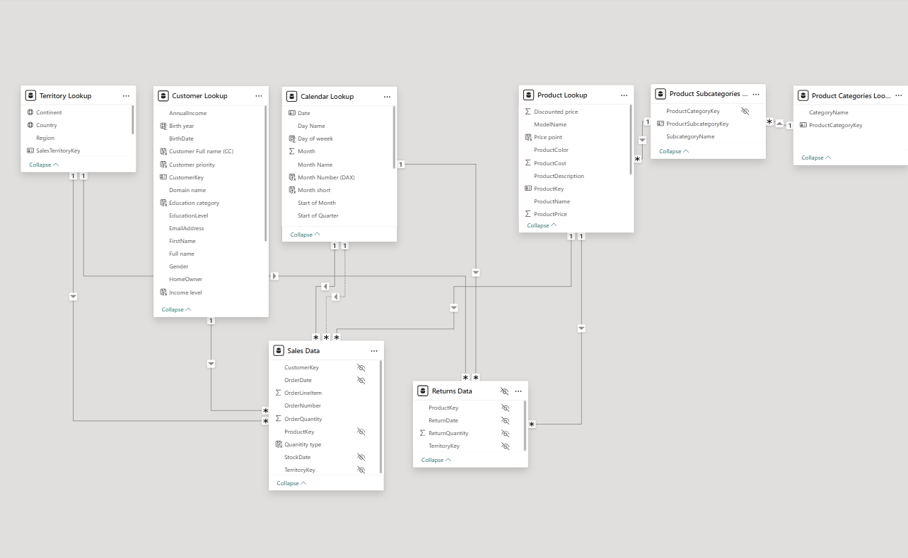
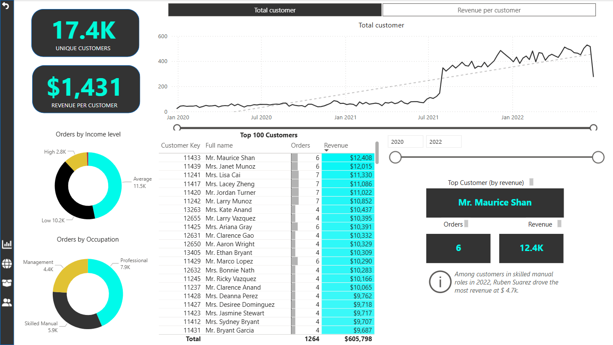
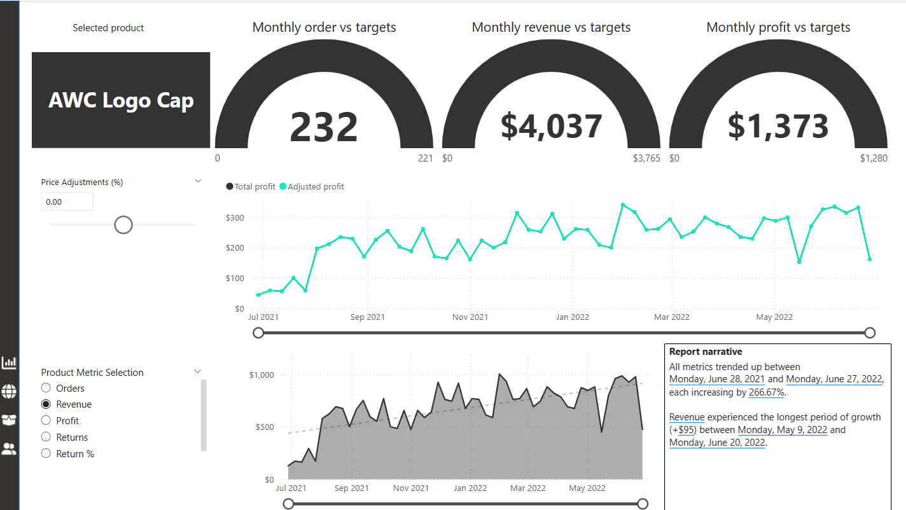
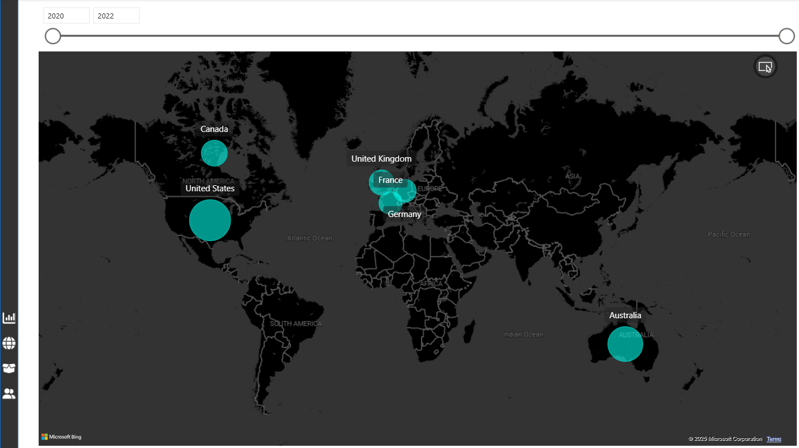
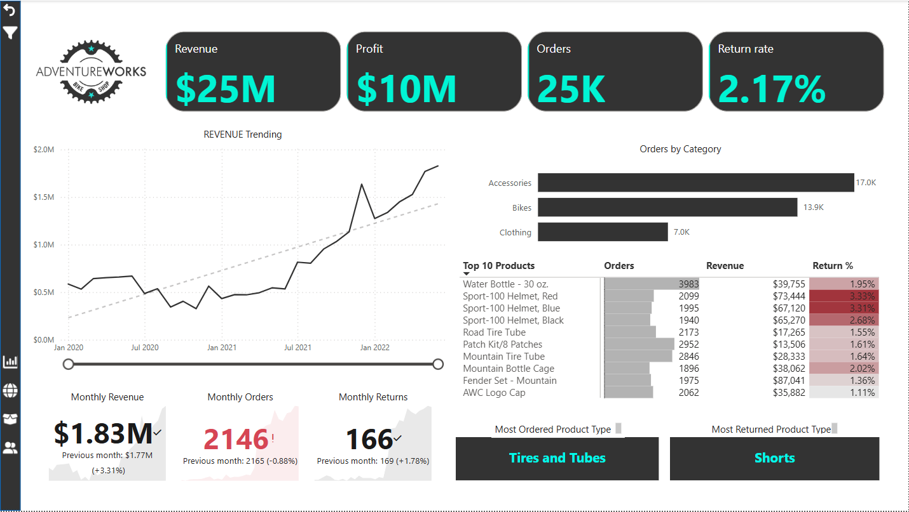
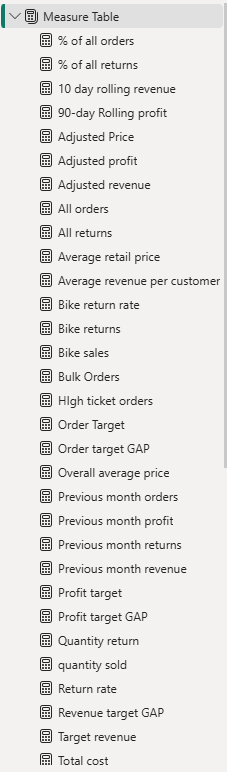
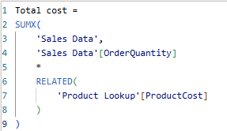

# 📊 AdventureWorks Sales Dashboard (Power BI)

This project presents a professional Power BI dashboard developed using the **AdventureWorks** dataset. It provides a deep dive into sales performance, customer demographics, and product trends through interactive visuals.

---

## 🧠 Project Objective

To analyze AdventureWorks’ sales data and uncover business insights using dynamic reports and key performance indicators (KPIs).

---

## 🔧 Tools Used

- **Power BI Desktop**
- **Power Query (M language)**
- **DAX (Data Analysis Expressions)**

---

## 📈 Key Features

- 📍 **Sales by Region** – Compare total revenue across different geographic areas  
- 🛒 **Top-Selling Products** – Visualize top products by revenue and quantity  
- 🧑‍🤝‍🧑 **Customer Demographics** – Segment analysis by age, gender, location  
- 🕒 **Time Trends** – Monthly and yearly performance breakdown  
- 📌 **KPI Cards** – Track total revenue, profit margins, and sales growth  
- 🎛️ **Slicers** – Dynamic filters for product category, region, year, etc.

---

## 📸 Screenshots

### Data Model  

### Customer Insights  

### Product Insights  

### Map Visualization  

### Executive Summary  

### DAX Examples  
  

---

## 📂 File

- `AdventureWorks_Farid.pbix` — Open with Power BI Desktop

---

## 📬 Author

**Farid Pashazadeh**  
📧 [faridpashap@gmail.com](mailto:faridpashap@gmail.com)  
🌍 Based in Warsaw, Poland  
🔗 [[LinkedIn Profile](https://www.linkedin.com/in/farid-pasha/)](#) (Add your real link)

---

## 🏷️ Tags

`powerbi` `data-visualization` `dashboard` `business-intelligence` `dax` `portfolio` `adventureworks`
